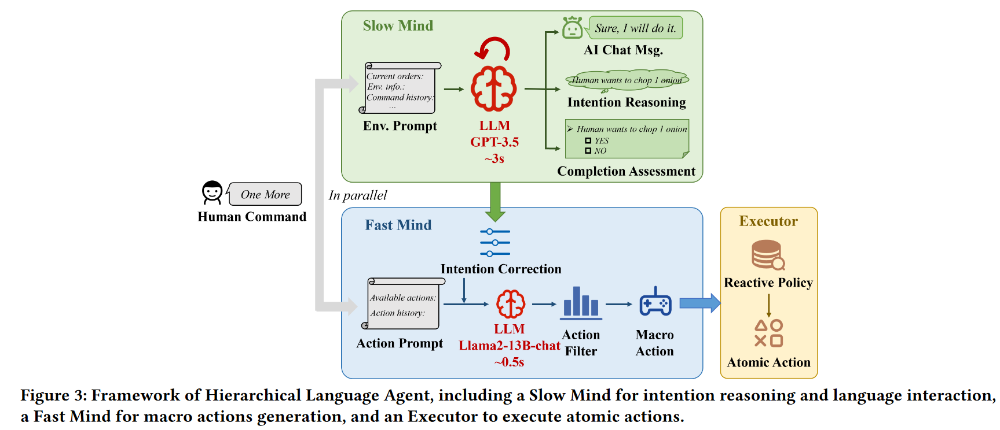
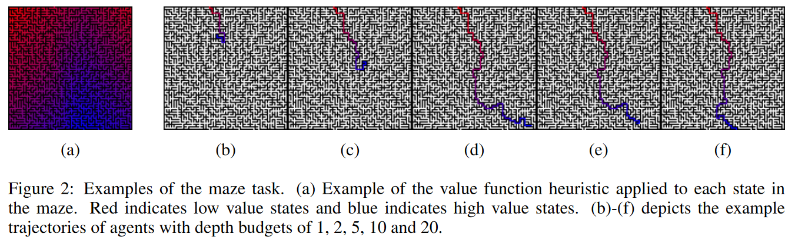
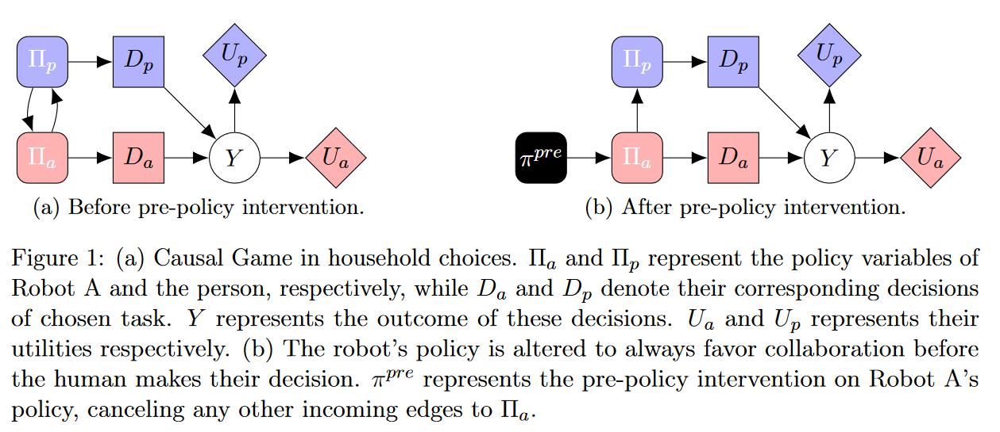
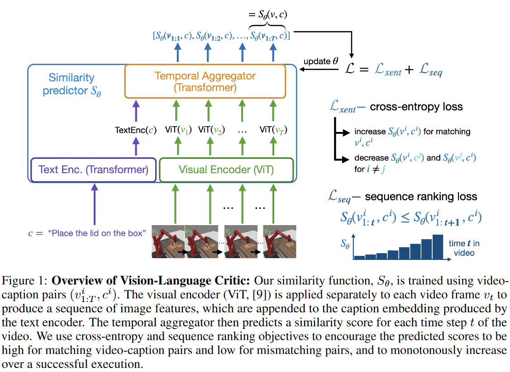
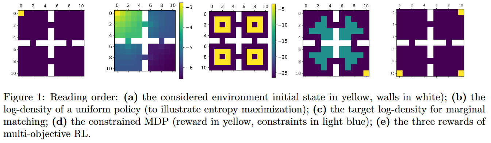
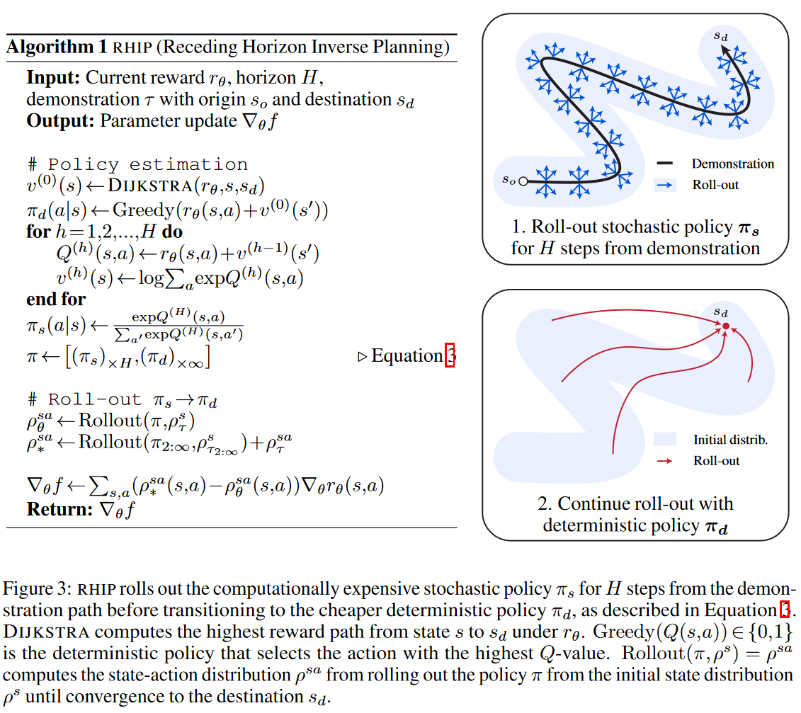
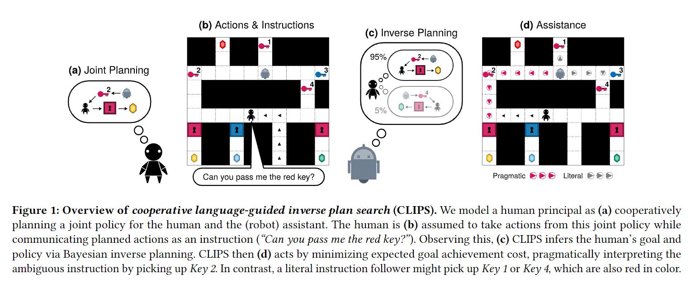
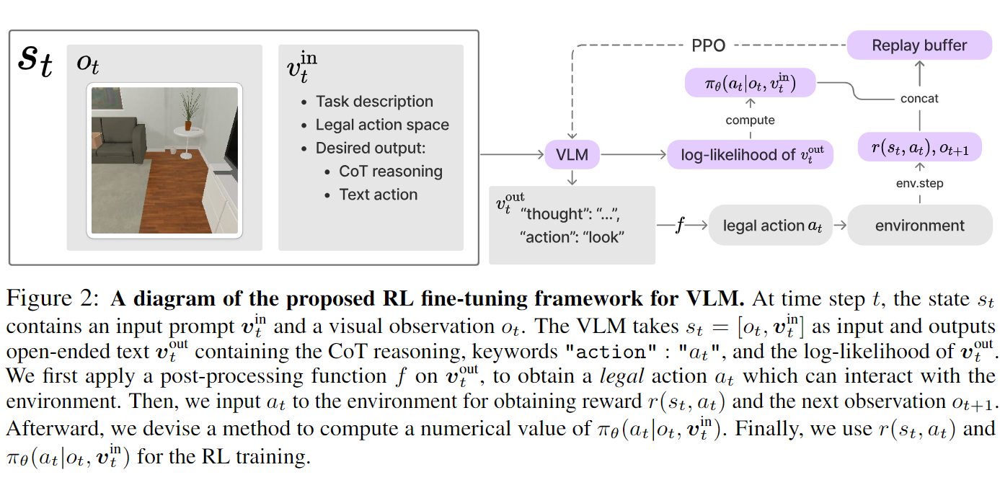

# Paper notes

### [Osman+ 23](http://arxiv.org/abs/2305.02748), "A computational framework of human values for ethical AI", AAMAS2024

* 行動に関する価値観（values）をDirected acyclic graph(DAG)で定義
  * top nodeは最も抽象的なvalue (ex. fairness)
  * 子ノードは具体
  * leaf node(=property)は，指標化可能な具体例
  * 各nodeはimportanceをもつ
* 提案内容
  * 定義，特にimportanceの一貫性の計算方法
  * だれにとってのvaluesか？：個人，または集団
  * Context-based，importanceをcontextに応じて計算
  * value-alignment, behaviorとvalueのアライメントを，importanceで重みづけしたnodeのlabelとbehaviorの近さで定義
* だれのvalueでどう指定するか，groundingの方法は，などopen problemは多い

### [Liu+ 24](https://arxiv.org/abs/2312.15224), "LLM-Powered Hierarchical Language Agent for Real-time Human-AI Coordination", AAMAS2024

* リアルタイムの協調ベンチマークOvercookedを解くAgent
  * originalのOvercookedを拡張して，エージェントの間でテキストコミュニケーションが取れる
* 二つのLLMを階層的に組み合せ
  * slow mind: 推論能力が高く，latencyも高いLLM (gpt3.5)
    1. 人間のinstructionを意図を生成
    2. chat textと，taskが完了したかを生成
  * fast mind: 推論能力が低く，latencyも低いLLM (Llama2)
    * 観測とslow mindの推論結果から，macro actionを生成
    * primitive actionはmacro actionからのマッピングを事前に用意
    * slow mindの結果が得られるまでは観測情報をそのまま入力する
  * LLMはプロンプト，周辺はルールベース．
* 提案のいずれかを削ったAgentと比較して，人間からのテキストへの制限に関わらず，提案法のタスク達成率が高い
* 複数のLLMを組み合わせる提案は多いが、LLM能力差を吸収できるという点が面白い
* [動画](https://sites.google.com/view/overcooked-hla/)

### [Jacob+ 23](https://arxiv.org/abs/2312.04030), "Modeling Boundedly Rational Agents with Latent Inference Budgets", ICLR2024 (poster), (2023)

* 計算budgetパラメータ$\beta$と報酬パラメータ$\theta$を軌跡（状態行動系列集合）から推定
  * Bolzmann分布の温度によるノイズ付加だけでは説明できない，非合理的な行動をモデル化
* 3つのタスクで，それぞれ$\beta$を含む順モデルを定め，データ尤度最大化問題を解く
  * タスク：迷路探索，reference game，chess
  * 分布$p(\beta|\mu_i)$の期待値を尤度とする
  * 全ての$\beta$ごとに順モデルを解くのはintractableなため， タイムステップ$i$ごとの順モデルの状態$f_i$に分解し(anytime algorithm, def. 1)，$\beta$を$i$に関するパラメータとみなす
  * 推定はadam gradを使ったMAP推定．$\beta$の分布は，[Open review](https://openreview.net/forum?id=W3VsHuga3j)によれば，feed-foward NN（入力$\mu_i$，出力$\beta$の確率分布）で学習

### [Hämäläinen+ 23](https://proceedings.mlr.press/v216/hamalainen23a), "Differentiable User Models", In Proceedings of the Thirty-Ninth Conference on Uncertainty in Artificial Intelligence Pp. 798–808. PMLR. (2023)

* ベイズの定理に基づくユーザーのパラメータ推定と行動予測について，それぞれをNNで代替．学習はmeta-trainingで，事前分布のパラメータ空間についてシミュレータのデータで学習．推論時は，訓練済みのNNを用いるため，尤度計算や追加学習は不要．NNはneural process
* 実験はGrid worldとメニュー検索（行動推定とアシスタントへの実装）
* meta-trainingと推論時でモデルが異なる状況は，学習データにノイズを入れた実験（実験2）のみ．ノイズに対してロバスト，かつ，ノイズが少ないほど精度が上がることを実験的に示している

### [Yang+ 24](http://arxiv.org/abs/2402.17139), "Video as the New Language for Real-World Decision Making", arXiv (2024)

* 動画生成の基盤モデルについて動向まとめ
* 複数のcomputer visionタスク，テキストの質問に対する動画での回答，画像に基づく推論などを，LLMのように，単一モデルで扱える可能性がある．また，この基盤モデルは世界モデル，つまり，ゲームや身体モデル，科学的な物理法則等のシミュレータとも見なせる
* 課題は，データの少なさ，ラベルの不足，モデル選択，Hallucination，汎化性能
* 有望な研究方向は，動画版のRLHFや，動画を物理的な行動へgroundingしFBから自己改善させる方向を上げている
<!-- * 動画を扱う理由に，言語では取りこぼす情報があることを挙げているが，Hallucinationとは相性が悪いように見える． -->
<!-- * SORAなどの動向を踏まえると，この辺り，資本の力の限界を，2年後くらいに見れるかな？ -->

### [Liu+ 24](https://arxiv.org/abs/2405.16588), "Attaining Human`s Desirable Outcomes in Human-AI Interaction via Structural Causal Games", arXiv (2024)

* 2エージェント（AIと人間）間の相互作用をStructural Causal Gameで定式化
* 複数のNash均衡が存在する問題において，AI側に介入（pre-policy intervention）することで，人間の効用上，望ましい均衡になるよう誘導
* 実験はLLMベース．交渉問題と情報プロテクト
<!-- * 因果推論とゲーム理論を組み合わせたものは面白い -->
<!-- * 人間の効用が既知，Nash均衡が計算可能，介入量の学習アルゴリズムが非常にシンプルな点に改善の余地あり -->

### [Alakuijala+ 24](https://doi.org/10.48550/arXiv.2405.19988),"Video-Language Critic: Transferable Reward Functions for Language-Conditioned Robotics", arXiv (2024)

* タスク文字列と画像系列に対する非マルコフな報酬を自己教師あり学習
  * タスクを表す文字列cと動画vから，各時刻までの画像列とcの一致度を密な報酬関数（本文中はスコア）として学習
  * 訓練データには，行動や報酬ラベルが含まれず，動画がタスクを達成していればよい
  * TransformerベースのNNを，自己教師あり学習の枠組みで学習
  * ロスは二種類．ペアのvとcのスコアを上げ，ペアでないvとcのスコアを下げるcross-entorpyロスと，時刻方向に報酬が上がるよう促すsequential ranking loss
* 未学習のタスクやOpen-Xにおいて，学習速度が速く，タスク達成度が高いケースあり

### [Geist+ 22](https://arxiv.org/abs/2106.03787v4), "Concave Utility Reinforcement Learning: The Mean-Field Game Viewpoint", AAMAS (2022)

* Concave Utility Reinforcement Learning(CURL)がMean-Feald Game(MFG)として解けるケースとそのアルゴリズム、GridWorldの実験をまとめている
  * CURLの目的関数は，状態行動対して定義される報酬を元にするのではなく，その確率分布に対する評価関数として広義に定義されるのがミソ
  * 同じ解法で模倣学習や多目的最適化、制約付き強化学習を扱える
* concaveなFを最大化する方策は、Fの偏微分を報酬とみなすMFGのナッシュ均衡に一致
* 仮想プレイとオンライン鏡像降下法で解いた場合の数値実験では、後者の学習速度が速い
<!-- * 非合理モデルが何処まで含まれるか？ -->

### [Barnes+ 23](https://arxiv.org/abs/2305.11290), "Massively Scalable Inverse Reinforcement Learning in Google Maps", arXiv (2024)

* 世界の道路ネットワーク（Google Map）で110Mの軌跡を使う大規模なIRL．決定的環境・割引率なし．
* MaxEnt IRLをベースに下記を組み合わせ
  1. mixture-of-experts: 分割されたregionごとに報酬推定
  2. 状態価値の初期値をダイクストラ法で与える
  3. 状態行動分布を求めるために，二つの方策をmixした行動分布（demonstrationの状態分布からH step先まで確率的方策，その先から目的地状態までダイクストラ法で求めた決定的方策）を使用
  4. 道路ネットワークを圧縮（①ノード次数を下げるよう分割（ノード数の増加より削減量が大きい），２#edge=1のnodeを結合）
* demonstrationに対する一致度（特にAccuracy，IoU; Intersection over Union of trajectory edges）で提案法が最も良い．学習された経路には，私有地であっても通り抜け可能な経路が含まれた

### [Zhi-Xuan+ 24](http://arxiv.org/abs/2402.17930) “Pragmatic Instruction Following and Goal Assistance via Cooperative Language-Guided Inverse Planning.”, arXiv (2024)

* HumanとAssistantの2人ゲーム．2エージェントのjoint actionに関する共通のコストを最小化．
* ゴールとそれに対応する実行中の方策が不明な状況で，過去の行動履歴からベイズでゴールと方策を推定
* アルゴリズムのキモはwで，$P(g,\pi)$を計算している．
* wの定義で因果（Do）を考慮して，joint行動の尤度ではなく，humanの行動の尤度だけ考慮する点に工夫
* 実験環境でPDDLを用いている
* 発展的
  * PDDL，juliaでの実装あり．周辺問題の参考になりそう．

### [Hao+ 22](https://proceedings.neurips.cc/paper_files/paper/2022/file/51ae7d9db3423ae96cd6afeb01529819-Paper-Conference.pdf) “Teacher Forcing Recovers Reward Functions for Text Generation.”, NeurIPS 2022

* Teacher Forcing（TF）が逆強化学習（IRL）の目的関数と等価であることを示し，学習コーパスから報酬を明示的に求めて，その報酬でRLする．
* コーパスがnon-parallelなことがミソ
* 疑問
  * 並列・非並列なコーパスとは？
  * TFの定義は「テキスト生成の文脈で，与えたテキストの尤度を最大化する問題」で正しい？

### [Li+ 24](https://aclanthology.org/2024.lrec-main.932.pdf) “LLMR: Knowledge Distillation with a Large Language Model-Induced Reward.”, Proceedings of the 2024 Joint International Conference on Computational Linguistics, Language Resources and Evaluation (LREC-COLING 2024)

* [Hao+ 22]を知識蒸留に利用
* 生徒モデルの出力を教師モデルに入力．間接的に教師モデル上の報酬を計算して，その報酬を用いたRLで生徒モデルを学習

### [Zhai+ 24](http://arxiv.org/abs/2405.10292), “Fine-Tuning Large Vision-Language Models as Decision-Making Agents via Reinforcement Learning.” arXiv, 2024

* VLMをRLでfine-tuning
* ミソは下記2つ
  1. VLMのinputにtask description，outputにCoTとActionがそれぞれ含む
  2. 行動の尤度（方策）を，CoTとActionに対応するトークン列ごとに項を分解し，スケールパラメータを導入（CoTとActionでトークン長が異なることを補う）
* RLHFと同様にタスクのデータでSFTをかけてからRLを実行しているのもポイント
* 実験規模(GPU memory)は80GB(A100x8)

